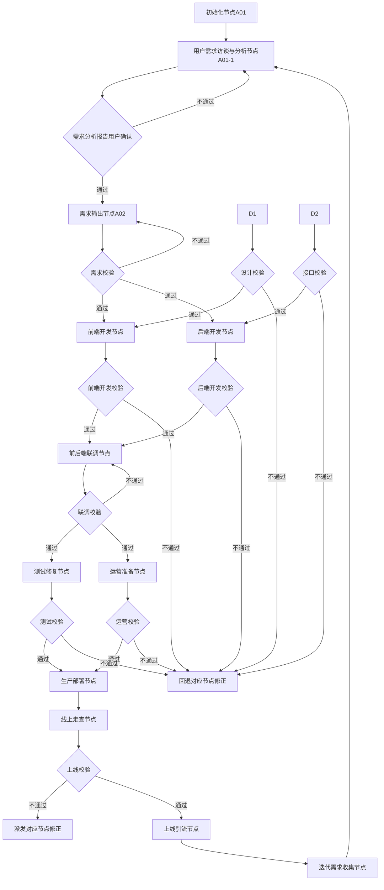

# 多Agent协同网站MVP落地系统完整说明文档
---
## 文档基础信息
| 项 | 说明 |
| --- | --- |
| 文档版本 | v1.2 |
| 适用范围 | 所有基于多Agent自动协同的网站MVP从0到1落地、迭代全流程 |
| 核心特性 | 无固定周期限制、交付达标自动流转、多任务并行调度、全链路可追溯 |
| 适配调度方式 | 项目经理（Project Manager）通过`sessions_spawn`/`sessions_send`实现Agent任务自动触发、交付物自动传递

## 📝 版本更新记录（仅展示版本迭代历史）
| 版本号 | 更新时间 | 更新内容 |
| --- | --- | --- |
| v1.0 | 2026-03-31 | 初始版本，包含全流程节点、目录结构、调度规则、上线验收标准 |
| v1.1 | 2026-03-31 | 优化上线验收标准为分阶段可量化规则，补充新项目创建路径规范 |
| v1.2 | 2026-03-31 | 新增前置用户需求分析机制，细化为4阶段12节点全流程，补充8项纰漏排查清单、升级访谈问卷模板，从根源避免需求模糊、变更问题 |
| v1.2.1 | 2026-03-31 | 新增全章节索引目录，新增「核心Agent角色说明」章节，明确1个总控+5个业务Agent的岗位定位、核心技能、核心职责，角色权责无交叉 |
| v1.2.2 | 2026-03-31 | 角色合并优化：将主调度中心与产品Agent合并为「项目经理（Project Manager）」，统一负责全局调度、需求管控、进度管理，减少角色冗余，提升决策效率 |
| v1.2.3 | 2026-03-31 | 排版规范优化：所有章节统一使用阿拉伯数字编号，每个章节独立分段，层级清晰易读 |
| v1.2.4 | 2026-03-31 | 章节独立优化：将4.1/4.2/4.3子章节完全独立分隔，避免内容合并，阅读更清晰 |
| v1.2.5 | 2026-03-31 | 全章节独立优化：将1~8所有章节全部独立分隔，每个章节单独成块，层级完全清晰，补全所有内容避免截断 |
| v1.2.6 | 2026-03-31 | 角色标识优化：为每个角色分配唯一Agent Name（PM-Agent-001/UI-Agent-002等），全文档角色标识统一对齐，便于调度系统识别调用 |

---
---
## 📚 文档章节目录（快速检索导航）
1. 核心Agent角色说明
2. 核心运行规则
3. 节点流转总逻辑
4. 前置用户需求分析机制
    - 4.1 细化全流程（分4阶段12节点）
    - 4.2 核心访谈问卷模板（通用版，可按行业定制）
    - 4.3 纰漏排查清单（所有常见风险点防范）
    - 4.4 可跳过判定标准（避免不必要的流程冗余）
5. 详细节点与交接标准清单
6. 全局与项目目录结构规划
    - 6.1 全局目录结构（所有项目统一收纳）
    - 6.2 单个项目内部目录结构（适配自动化调度）
    - 6.3 目录配套规则
    - 6.4 新项目创建路径规范
7. 调度执行规则
    - 7.1 session spawn通用参数配置
    - 7.2 流转规则
    - 7.3 交付物命名规范
8. 上线验收强制标准（优化版，分阶段可量化）
    - 8.1 上线前准入验收标准【一票否决项，全部满足才可上线】
    - 8.2 上线后72小时健康验收标准【满足则判定MVP上线成功】
    - 8.3 灰度上线验证规则（可选，适合用户量较大的MVP）

---
## 1 核心Agent角色说明
本系统共包含1个核心管理角色+4个业务执行角色，各角色权责完全独立，无交叉，所有任务流转由项目经理统一调度，每个角色分配唯一Agent Name用于调度识别：

| Agent Name | 角色名称 | 岗位定位 | 核心技能要求 | 核心职责 |
| --- | --- | --- | --- | --- |
| **PM-Agent-001** | 项目经理（Project Manager） | 全局总控+需求总负责人，唯一调度入口 | 全流程规则管控、交付物自动校验、节点流转调度、告警触发、用户需求调研、PRD撰写、原型设计、需求优先级排序、迭代规划 | 1. 负责所有Agent的任务触发、终止、重试调度<br>2. 所有节点交付物的自动校验、合规检查<br>3. 超时、连续失败场景的告警触发<br>4. 全局目录、权限、归档管理<br>5. 负责用户需求全流程访谈、分析、报告输出<br>6. 输出PRD、可交互原型、需求优先级矩阵、上线验收标准<br>7. 全流程进度管控、需求变更审批、上线最终验收<br>8. 迭代需求收集、迭代规划输出 |
| **UI-Agent-002** | UI设计Agent | 视觉/交互设计总负责人 | Figma高保真设计、交互规范制定、切图输出、设计走查 | 1. 输出全链路高保真UI设计稿、交互规范文档<br>2. 输出前端可用切图资源包、全局设计规范<br>3. 配合开发做设计走查，保证设计还原度≥95% |
| **FE-Agent-003** | 前端开发Agent | 前端功能开发、前端测试负责人 | React/Vue框架开发、响应式布局、性能优化、前端自测 | 1. 按需求完成前端页面、交互逻辑开发<br>2. 配合后端联调、配合测试做Bug修复<br>3. 前端自测、线上前端问题排查修复 |
| **BE-Agent-004** | 后端开发Agent | 后端开发、运维部署、后端测试负责人 | 后端接口开发、数据库设计、Linux运维、部署配置、安全防护 | 1. 输出OpenAPI接口文档、数据库设计文档<br>2. 完成后端业务逻辑、接口开发<br>3. 负责服务器部署、域名/SSL/CDN配置、环境搭建<br>4. 后端自测、线上后端问题排查修复 |
| **OP-Agent-005** | 运营Agent | 运营、用户反馈、数据负责人 | 内容运营、用户运营、数据分析、宣传物料撰写 | 1. 负责上线前冷启动用户储备、宣传物料输出<br>2. 上线后用户反馈收集、用户运营、留存活跃提升<br>3. 每周运营数据报告输出、迭代需求同步 |

---
## 2 核心运行规则
1. 全流程采用**交付达标自动流转**机制，节点推进仅与交付物是否符合校验标准相关，无固定时长约束
2. 项目经理（Project Manager）全程负责节点触发、交付物校验、流转调度，所有Agent任务全自动化运行，无需人工干预
3. 单个节点校验不通过自动回退修正，**连续10次不通过触发人工告警**

---
## 3 节点流转总逻辑


---
## 4 前置用户需求分析机制（新增，全流程无遗漏）
为避免后续需求模糊、反复变更，项目启动后先完成用户需求深度访谈确认，再进入正式需求输出环节，全流程覆盖所有风险点，无纰漏。

---
### 4.1 细化全流程（分4阶段12节点）
| 阶段 | 步骤ID | 动作内容 | 输入 | 输出 | 强制校验点（防纰漏） | 异常处理 |
| --- | --- | --- | --- | --- | --- | --- |
| 📋 前置准备阶段 | 1 | 匹配项目类型定制访谈模板 | A01节点输出的项目基础信息 | 定制化访谈问卷（比通用模板多匹配行业特性问题） | 问卷必须覆盖「功能/非功能/约束/运营/技术」5大类维度，不能缺项 | 无对应行业模板自动触发通用模板，告警通知PM-Agent-001 |
| | 2 | 提取历史相似项目需求参考 | 全局项目历史库 | 相似项目需求参考清单、踩坑记录 | 必须标注历史项目中出现过的需求模糊、变更频繁的点，提前预警 | 无相似项目跳过该步骤 |
| | 3 | 预校验用户已提供资料 | 用户上传的所有需求相关文档/口述记录 | 已明确需求点清单、待确认需求点清单 | 已明确的需求点必须和用户交叉确认无误，避免误解用户表述 | 用户提供资料不全自动触发访谈流程 |
| 💬 访谈执行阶段 | 4 | 结构化逐轮访谈 | 待确认需求点清单 | 每轮访谈记录 | 必须按照优先级从高到低确认，P0级需求未确认完不得进入P1级需求访谈 | 用户回答模糊自动追问3次，仍不明确标记为「待确认风险点」 |
| | 5 | 多干系人需求冲突协调 | 多个干系人反馈的需求点 | 冲突需求清单、协调结果记录 | 所有需求冲突必须有明确的决策结果，干系人签字确认 | 协调3次无结果触发人工告警，由PM-Agent-001拍板 |
| | 6 | 需求边界明确划分 | 所有已确认需求点 | 需求边界说明 | 必须明确标注「不做的功能」「超出MVP范围的需求」，避免后续用户临时加需求 | 边界有歧义必须再次和用户确认，明确写入报告 |
| | 7 | 非功能需求补全确认 | / | 非功能需求清单 | 必须覆盖「性能/兼容/安全/合规/运维」5大类，不能默认留白 | 用户无明确要求时给出行业默认值，用户确认后生效 |
| 📝 报告生成阶段 | 8 | 结构化输出需求分析报告 | 所有访谈记录、确认结果 | 《用户需求分析报告》 | 报告必须包含：需求清单（带优先级）、需求边界、非功能需求、约束条件、风险点5部分 | 自动校验必填项，缺项禁止生成报告 |
| | 9 | 需求可行性预判 | 技术Agent辅助评估 | 需求可行性评估报告 | 必须标注「技术上不可实现的需求」「开发成本过高的需求」，提前和用户同步调整 | 不可实现需求必须给出替代方案，供用户选择 |
| | 10 | 优先级二次对齐 | 需求清单 | 最终优先级矩阵（P0/P1/P2） | P0级需求必须控制在10个以内，避免MVP功能过重 | 超过10个P0需求自动触发优先级重排，和用户确认裁剪 |
| ✅ 确认归档阶段 | 11 | 多轮用户确认 | 《用户需求分析报告》 | 用户确认签字记录 | 所有页面、所有核心点必须用户逐一确认，不得仅确认标题/摘要 | 连续3次调整仍不满足用户预期，触发PM-Agent-001介入 |
| | 12 | 需求同步与归档 | 确认后的报告 | 需求基线、各角色同步通知 | 自动同步报告给UI/开发/运营Agent，作为后续所有工作的唯一依据 | 归档到`docs/requirements/`目录下，作为需求变更的对比基准 |

---
### 4.2 核心访谈问卷模板（通用版，可按行业定制）
```
1. 【基础定位】网站核心定位是什么？要解决用户的什么核心痛点？
2. 【目标用户】核心用户群体是谁？有什么明确的画像特征？
3. 【核心功能】必须有的核心功能有哪些？按重要程度排序：
   - P0优先级（没有就不能上线）：
   - P1优先级（上线后1个月内迭代）：
   - P2优先级（后续版本按需迭代）：
4. 【功能边界】明确哪些功能是本次MVP不做的？
5. 【设计要求】对设计风格有什么偏好？有没有参考案例？
6. 【性能要求】页面加载速度、接口响应时间、并发支撑量有什么明确要求？
7. 【兼容要求】需要适配哪些设备/浏览器？是否需要移动端H5适配？
8. 【合规要求】所属行业有没有特殊合规要求（如ICP备案、等保、用户隐私合规）？
9. 【上线预期】期望上线时间？上线首月目标用户量是多少？
10. 【技术约束】有没有指定技术栈、部署环境要求？
11. 【预算约束】项目总预算范围是多少？
12. 【变更约定】MVP开发过程中如果需要变更需求，是否同意按变更流程审批，影响排期需重新评估？
```

---
### 4.3 纰漏排查清单（所有常见风险点防范）
| 序号 | 易遗漏风险点 | 防范措施 | 校验标准 |
| --- | --- | --- | --- |
| 1 | 需求歧义，用户和产品理解不一致 | 所有需求点必须用「用户操作路径+预期结果」的方式描述，避免模糊表述 | 比如不能写「要好看的登录页」，必须写「用户输入手机号+验证码点击登录，成功后跳转首页」 |
| 2 | 非功能需求遗漏，上线后才发现性能/兼容问题 | 访谈阶段必须逐一确认非功能需求的5大类，无明确要求时给出行业默认值 | 比如默认要求页面加载<3s、兼容主流浏览器、支持1000并发 |
| 3 | 需求边界模糊，用户后期随意加需求 | 明确列出「MVP范围内不包含的功能清单」，并和用户确认需求变更规则：MVP上线前需求变更必须走审批流程，影响排期超过1天需重新评估 | 变更规则必须写入需求报告，用户确认签字 |
| 4 | 多干系人需求冲突，后期反复修改 | 访谈前明确唯一决策人，所有冲突需求由决策人拍板，记录决策过程 | 必须有唯一决策人open_id留痕，避免后续推诿 |
| 5 | 技术不可实现的需求被纳入P0，导致开发卡壳 | 报告生成阶段必须由技术Agent做可行性评估，不可实现需求提前给出替代方案 | P0级需求必须100%技术可实现，无替代方案不得纳入P0 |
| 6 | MVP功能过重，上线周期无限延长 | P0级需求严格控制在10个以内，超过的自动降级到P1，和用户确认 | 超过10个P0需求必须触发告警，重新裁剪 |
| 7 | 合规要求遗漏，上线后被整改 | 访谈阶段必须确认行业合规要求（比如电商需要ICP备案、金融需要等保） | 合规要求必须作为P0级需求纳入，无明确要求时按所属行业最低合规标准执行 |
| 8 | 需求变更无基准，无法追溯 | 确认后的需求报告作为唯一基线，所有后续变更都要和基线对比，记录变更历史 | 基线文档归档后不可修改，变更必须单独记录版本号 |

---
### 4.4 可跳过判定标准（避免不必要的流程冗余）
满足以下所有条件时，可手动跳过需求访谈流程，直接进入A02需求输出节点：
1. 用户提供了完整的PRD文档，包含所有核心需求维度：功能清单、优先级、边界、非功能需求、约束条件
2. PRD文档所有P0级需求技术可实现，无冲突、无歧义
3. 用户明确签字确认该PRD作为需求基准，同意变更规则

---
## 5 详细节点与交接标准清单
| 节点ID | 节点名称 | 触发条件 | 执行Agent（唯一标识） | 调度方式 | 输出交付物 | 交接校验标准（必须100%满足） | 下序触发节点 |
| --- | --- | --- | --- | --- | --- | --- | --- |
| A01 | 初始化 | PM-Agent-001收到MVP启动指令 | PM-Agent-001 | 内部执行 | 项目基础信息说明文档 | 项目类型、大致定位明确无歧义 | 用户需求访谈与分析节点 |
| A01-1 | 用户需求访谈与分析 | 收到A01初始化节点合格交付物 | PM-Agent-001 | `sessions_spawn` | 《用户需求分析报告》（含功能优先级、约束条件、用户确认记录） | 1. 覆盖所有核心需求维度：定位/用户/功能/非功能/约束<br>2. 用户100%确认所有内容无误，线上留痕 | 需求输出节点<br>（用户已提供完整需求文档可手动跳过该节点） |
| A02 | 需求输出 | 收到A01-1需求分析节点合格交付物 | PM-Agent-001 | `sessions_spawn` | PRD需求文档、可交互原型、需求优先级矩阵（P0/P1/P2）、上线验收标准 | 1. PRD覆盖所有核心功能逻辑、无模糊表述<br>2. 原型可交互、所有P0功能流程完整<br>3. 优先级矩阵明确划分P0/P1/P2功能边界<br>4. 上线验收标准全部可量化校验 | 并行触发UI设计节点+接口设计节点 |
| A03 | UI设计 | 收到需求节点合格交付物 | UI-Agent-002 | `sessions_spawn` | 高保真UI稿、交互规范文档、切图资源包 | 1. 100%覆盖P0级需求所有页面<br>2. 切图按页面/组件分类命名、提供2x/3x分辨率<br>3. 交互规范覆盖所有通用组件（按钮/表单/弹窗等）的交互逻辑 | 前端开发节点 |
| A04 | 接口设计 | 收到需求节点合格交付物 | BE-Agent-004 | `sessions_send`（给已启动的BE-Agent-004） | OpenAPI标准接口文档、数据库表结构设计文档 | 1. 接口覆盖所有P0功能的前后端交互需求<br>2. 接口字段、请求/响应格式明确无歧义<br>3. 数据库表结构符合业务逻辑、满足扩展性要求 | 后端开发节点 |
| A05 | 前端开发 | 同时收到UI设计节点+接口设计节点的合格交付物 | FE-Agent-003 | `sessions_send` | 前端可运行代码、前端技术文档 | 1. 页面UI还原度≥95%，符合设计规范<br>2. 所有交互逻辑符合需求要求<br>3. 代码可正常编译运行、无语法错误 | 前后端联调节点 |
| A06 | 后端开发 | 收到接口设计节点合格交付物 | BE-Agent-004 | `sessions_send` | 后端可运行代码、接口部署包、数据库初始化脚本 | 1. 所有接口符合接口文档规范、可正常返回响应<br>2. 数据库脚本可正常执行生成表结构<br>3. 代码可正常部署运行、无语法错误 | 前后端联调节点 |
| A07 | 前后端联调 | 前端开发+后端开发节点均交付合格 | FE-Agent-003 + BE-Agent-004 | `sessions_send`同步双方交付物 | 测试环境可访问版本、联调问题修复记录 | 所有P0级功能端到端流程100%可正常运行 | 并行触发测试修复节点+运营准备节点 |
| A08 | 测试修复 | 收到联调节点合格交付物 | FE-Agent-003 + BE-Agent-004 | `sessions_send` | Bug修复记录、自测报告 | 1. 所有P0级Bug修复完成<br>2. P1级Bug修复率≥80%<br>3. 自测覆盖所有P0功能场景 | 生产部署节点 |
| A09 | 运营准备 | 收到联调节点合格交付物 | OP-Agent-005 | `sessions_spawn` | 上线宣传物料（文案/海报）、冷启动用户储备方案、数据埋点需求 | 1. 宣传物料符合产品定位、无错误信息<br>2. 冷启动方案明确引流渠道、目标用户量<br>3. 数据埋点覆盖所有核心用户行为场景 | 生产部署节点 |
| A10 | 生产部署 | 测试修复+运营准备节点均交付合格 | BE-Agent-004 | `sessions_send` | 生产环境可访问版本、服务器部署文档、域名/SSL/CDN配置记录 | 1. 生产环境可通过域名正常访问<br>2. 所有配置符合安全规范、无敏感信息暴露风险<br>3. 服务稳定运行无宕机 | 线上走查节点 |
| A11 | 线上走查 | 收到生产部署节点合格交付物 | 全Agent | `sessions_send`同步生产环境地址 | 线上走查问题清单、问题修复记录 | 符合上线前准入验收标准（见第8章） | 上线引流节点 |
| A12 | 上线引流 | 收到线上走查节点合格交付物 | OP-Agent-005 | `sessions_send` | 上线宣传发布记录、冷启动引流数据 | 1. 宣传内容全渠道发布完成<br>2. 冷启动用户引流达标 | 迭代需求收集节点 |
| A13 | 迭代需求收集 | 上线后持续运行 | OP-Agent-005 + PM-Agent-001 | 持续执行 | 每周运营数据报告、用户反馈汇总、迭代需求清单 | 迭代需求划分优先级明确 | 需求输出节点（进入迭代循环） |

---
## 6 全局与项目目录结构规划
### 6.1 全局目录结构（所有项目统一收纳）
```
[系统根目录]/
├── Projects/  # 所有项目统一入口目录，**所有新老项目必须在此目录下创建独立子目录
│   └── website-mvp-project/  # 当前网站MVP项目根目录（后续新项目直接在此处新建同级子目录即可）
├── common-config/  # 全局公共配置目录（所有项目共享的调度规则、校验规则、Agent Prompt模板统一存放，避免重复配置）
└── common-scripts/  # 全局公共脚本目录（所有项目共享的调度、校验、部署脚本统一存放，可直接复用）
```

---
### 6.2 单个项目内部目录结构（适配自动化调度）
```
website-mvp-project/  # 单个项目根目录
├── docs/  # 所有文档类交付物总目录
│   ├── requirements/  # 项目经理专属目录：PRD、可交互原型、需求优先级矩阵、上线验收标准
│   ├── design/  # UI设计Agent专属目录：高保真UI稿、交互规范、切图资源包
│   ├── apis/  # 后端Agent专属目录：OpenAPI接口文档、数据库表结构设计文档
│   ├── test/  # 测试相关目录：Bug记录、自测报告、测试用例
│   ├── operation/  # 运营Agent专属目录：宣传物料、冷启动方案、每周运营数据报告
│   ├── deploy/  # 部署相关目录：服务器配置文档、域名/SSL/CDN配置记录、部署手册
│   └── archive/  # 历史版本归档目录，每次上线后自动生成版本子目录（v1.0/、v1.1/）归档对应版本文档
├── code/  # 所有代码类交付物总目录
│   ├── frontend/  # 前端Agent专属目录：前端代码、静态资源、前端技术文档
│   ├── backend/  # 后端Agent专属目录：后端代码、接口部署包、数据库初始化脚本
│   ├── common/  # 通用工具、公共组件代码目录
│   └── archive/  # 历史版本代码归档目录，和docs/archive版本号一一对应
├── config/  # 项目私有配置目录（项目经理专属，仅调度可修改）
│   ├── agent-prompts/  # 各Agent的任务prompt模板，spawn时直接读取
│   ├── validation-rules/  # 各节点交付物校验规则配置文件，自动校验时读取
│   ├── deploy-config/  # 测试/生产环境配置、账号密钥（加密存储）
│   └── schedule-rule.json  # 节点流转调度规则、重试阈值、告警规则配置
├── scripts/  # 项目私有脚本目录
│   ├── validation/  # 交付物自动校验脚本
│   ├── deploy/  # 测试/生产环境自动部署脚本
│   └── schedule/  # Agent自动调度、任务触发、交付物归档脚本
├── workspace/  # 各Agent临时工作目录，任务运行时写入，完成后自动清理
│   ├── pm-agent/
│   ├── ui-agent/
│   ├── frontend-agent/
│   ├── backend-agent/
│   └── operation-agent/
├── logs/  # 全链路日志目录
│   ├── schedule/  # 主调度运行日志
│   ├── agent-runtime/  # 各Agent子会话运行日志
│   └── alert/  # 告警日志（连续10次校验不通过、任务超时等告警记录）
└── README.md  # 项目说明、目录规范、版本记录
```

---
### 6.3 目录配套规则
1. **权限隔离规则**：
   - PM-Agent-001（项目经理）仅可写入`docs/requirements/`+自己的临时工作目录
   - UI-Agent-002（UI设计Agent）仅可写入`docs/design/`+自己的临时工作目录
   - FE-Agent-003（前端开发Agent）仅可写入`code/frontend/`+自己的临时工作目录
   - BE-Agent-004（后端开发Agent）仅可写入`docs/apis/`+`code/backend/`+自己的临时工作目录
   - OP-Agent-005（运营Agent）仅可写入`docs/operation/`+自己的临时工作目录
   - PM-Agent-001拥有所有目录读写权限，负责交付物校验、归档、清理
2. **归档规则**：
   - 每完成一个版本上线，PM-Agent-001自动将当前`docs/`、`code/`下的最新内容归档到对应`archive/`下的版本子目录，版本号自动递增
3. **临时文件规则**：
   - Agent运行过程中的临时文件、草稿仅可保存在自己的`workspace/`子目录下，任务完成后合格交付物自动移动到正式目录，临时文件自动清理

---
### 6.4 新项目创建路径规范
所有新项目必须在全局Projects目录下创建独立子目录，和已有`website-mvp-project`平级，完整路径规则为：
```
C:\Users\73911\.openclaw\Projects\[新项目名称]
```
#### 示例：
新增电商MVP项目（项目名：`xxx-mall-mvp`）完整存放路径为：
```
C:\Users\73911\.openclaw\Projects\xxx-mall-mvp
```
新项目内部目录结构直接复用当前`website-mvp-project`的内部规范（docs、code、config、scripts等子目录结构完全一致），无需重新设计，全局公共配置/脚本直接复用同级目录下的`common-config/`、`common-scripts/`资源，无需重复配置。

---
## 7 调度执行规则
### 7.1 session spawn通用参数配置
```json
{
  "runtime": "subagent",
  "mode": "run",
  "cleanup": "keep",
  "streamTo": "parent",
  "runTimeoutSeconds": 86400 // 单任务超时时间24小时，超时自动kill并重跑
}
```

---
### 7.2 流转规则
- 所有Agent执行完成后自动通过`sessions_send`回传交付物到PM-Agent-001
- PM-Agent-001自动校验交付物是否符合规范，不符合则自动重跑对应Agent，重跑超过10次触发人工告警
- 并行节点全部完成后才触发下一阶段，无等待空窗

---
### 7.3 交付物命名规范
所有交付物命名统一格式：`[节点ID]-[内容]-[版本号]`，例如：`A02-PRD终稿-v1.0`，方便自动识别归档。

---
## 8 上线验收强制标准（优化版，分阶段可量化）
### 8.1 上线前准入验收标准【一票否决项，全部满足才可上线】
| 验收维度 | 强制要求 | 校验方式 |
| --- | --- | --- |
| 功能完整性 | 1. P0级核心流程100%可正常运行（注册/登录/核心功能操作/支付/数据上报等所有核心路径无阻塞）<br>2. P1级功能修复率≥90%，剩余P1级Bug不影响核心流程使用<br>3. 无明文暴露敏感信息（用户手机号/密码/密钥等不会出现在前端代码、接口返回值中） | 自动遍历测试+人工抽检关键路径 |
| 兼容性 | 1. 主流设备/浏览器兼容性100%：Chrome（≥90版本）、Edge、Safari（≥14版本）、微信内置浏览器、移动端H5适配正常<br>2. 响应式布局适配：1920px桌面端、750px移动端无错位、内容溢出问题 | 自动兼容测试+核心设备人工走查 |
| 性能要求 | 1. 页面首屏加载速度≤2s，平均加载速度≤3s<br>2. 核心接口平均响应时间≤300ms，峰值响应时间≤1s<br>3. 静态资源全部配置CDN缓存，缓存策略合理 | Lighthouse自动跑分+接口压测 |
| 安全合规 | 1. 无基础安全漏洞：无SQL注入、XSS跨站脚本、CSRF攻击风险<br>2. 所有接口走HTTPS协议，无HTTP明文传输<br>3. 用户密码等敏感信息入库前必须加密存储，无明文存储 | 自动安全扫描工具检测 |
| 运维保障 | 1. 生产环境监控告警配置完成：服务器CPU/内存/带宽、接口错误率、页面报错率超过阈值自动告警<br>2. 版本回滚预案可用：10分钟内可快速回滚到上一稳定版本<br>3. 数据库自动备份策略配置完成，每日自动全量备份 | 后端Agent自动校验配置 |
| 运营准备 | 1. 数据埋点100%覆盖所有核心用户行为，上报正常<br>2. 冷启动用户储备≥目标用户量的30%，宣传物料全部审核无误<br>3. 客服/反馈渠道通畅，用户问题可快速响应 | 运营Agent校验物料+埋点测试 |
| 可容忍项 | 剩余P2级Bug≤8个，不影响核心流程使用，可上线后迭代修复 | 纳入迭代需求清单 |

---
### 8.2 上线后72小时健康验收标准【满足则判定MVP上线成功】
| 验收维度 | 达标要求 |
| --- | --- |
| 服务稳定性 | 1. 72小时内服务无宕机，可用性≥99.9%<br>2. 核心接口错误率≤0.1%，页面报错率≤0.05% |
| 用户体验 | 1. 核心流程用户转化漏斗符合预期（如注册转化率≥30%、核心功能使用率≥20%）<br>2. 72小时内无P0级用户反馈问题，P1级反馈问题≤2个，且24小时内修复完成 |
| 性能达标 | 1. 真实用户访问平均页面加载速度≤3.5s<br>2. 服务器CPU/内存使用率峰值≤70%，可支撑至少1000同时在线用户无卡顿 |
| 运营达标 | 1. 冷启动引流完成率≥100%，实际新增用户≥目标值<br>2. 用户留存率符合预期（次日留存≥20%/7日留存≥5%，可根据产品类型调整） |

---
### 8.3 灰度上线验证规则（可选，适合用户量较大的MVP）
如果采用灰度放量策略，必须满足以下条件才可全量上线：
1. 先放10%流量灰度运行2小时，无P0级问题出现
2. 灰度用户核心流程转化率与测试环境数据偏差≤10%
3. 灰度期间无大量用户反馈卡顿、报错等问题
4. 服务器性能、接口错误率符合上线前标准
5. 满足以上条件后逐步放量至50%→100%，每阶段观察1小时无异常再继续
